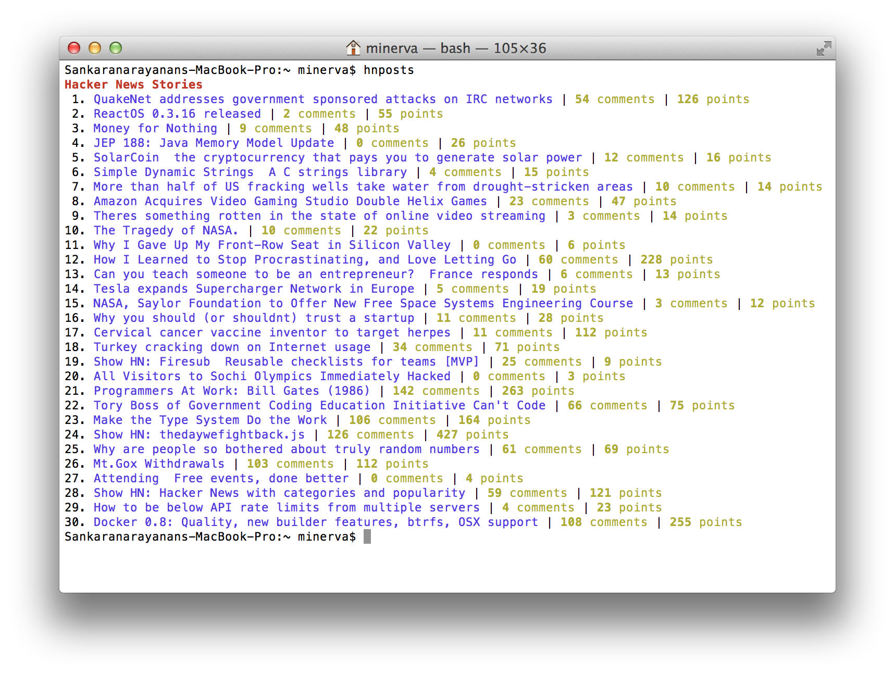

# HNPosts

Fetch front page articles from Hacker News

## Installation

    $ gem install hnposts

## Usage

    $ hnposts

## Screenshot

## Contributing

1. Fork it ( http://github.com/rationalrevolt/hnposts/fork )
2. Create your feature branch (`git checkout -b my-new-feature`)
3. Commit your changes (`git commit -am 'Add some feature'`)
4. Push to the branch (`git push origin my-new-feature`)
5. Create new Pull Request
